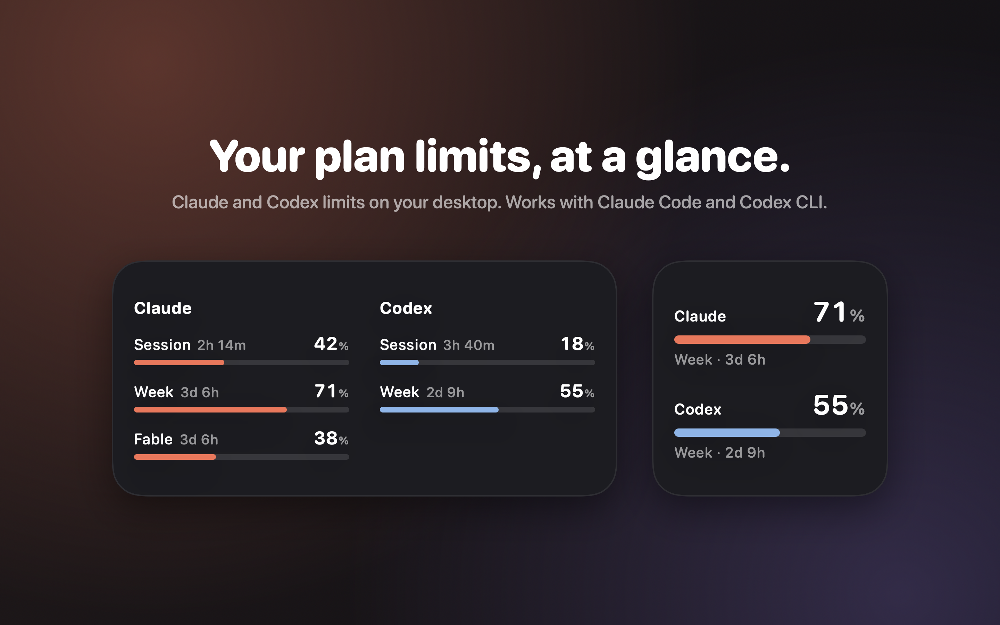

# Quota Rings

A macOS desktop widget and menu bar item that show your Claude and Codex plan limits: the session limit, the weekly limit and each per-model weekly limit.



Quota Rings is an independent app. It is not made, endorsed or supported by Anthropic or OpenAI.

## How it works

- `Quota Rings.app` runs in the menu bar and shows each tool's tightest limit, for example `Claude 51% · Codex 69%`. Its menu lists every limit with its reset time. The first time it runs, it asks whether to open at login.
- Every 5 minutes, after wake, and when you click the widget, the app reads Claude Code's OAuth token from the Keychain item `Claude Code-credentials` and calls `GET https://api.anthropic.com/api/oauth/usage`. Claude Code's `/usage` reads the same endpoint.
- On the same schedule it reads Codex limits from its session logs. See [Codex](#codex).
- It writes the result to `~/Library/Application Support/QuotaRings/usage.json` and reloads the widget.
- The widget is sandboxed. It has read-only access to that one folder and no network or Keychain access.

### Data sources

Pick one under **Data Source** in the menu bar menu.

| Source | Setup | How it fetches |
| --- | --- | --- |
| Claude Code sign-in (default) | None, if Claude Code is signed in | Keychain token, `GET api.anthropic.com/api/oauth/usage` |
| claude.ai sign-in | Sign in once in the app's login window | Own session key, `GET claude.ai/api/organizations`, then `GET claude.ai/api/organizations/{uuid}/usage` |

The claude.ai source needs no access to Claude Code, so it can also work inside the app sandbox. The login window uses a private web view store. The app keeps only the `sessionKey` cookie, in its own Keychain item `com.zentered.quotarings.claude-ai`, and saves a new key when claude.ai rotates it. Google sign-in may refuse to run in an embedded web view. The email code login works. Both claude.ai endpoints are undocumented.

The app never refreshes the Claude Code token. Refreshing would rotate the refresh token Claude Code stores and sign Claude Code out. When the token expires, the widget shows "Sign-in expired" until you run `claude` once.

`/api/oauth/usage` is not a documented public API. Its response shape can change.

### Codex

Codex needs no setup. After each model response, Codex CLI writes a `token_count` event with the account's `rate_limits` to its session log in `~/.codex/sessions/YYYY/MM/DD/rollout-*.jsonl`. Quota Rings reads the newest such event from the 5 most recent logs. It makes no network request and never reads `~/.codex/auth.json`.

- The numbers change only when Codex runs, so the newest event is current.
- A window whose `resets_at` has passed shows 0% until Codex logs again.
- Only events with `limit_id` `codex` count. Other pools, such as `premium`, are skipped.
- Codex stays hidden until one of the 5 newest logs contains limits.
- The log format is not a documented public API. It can change.
- A custom `CODEX_HOME` is not supported. The app always reads `~/.codex`.

## Widget states

| State | Shown when | Numbers |
| --- | --- | --- |
| Not running | The app has never written data | none |
| Not signed in | No Claude Code sign-in in the Keychain | cleared |
| No plan limits | The account has no Pro or Max limits | cleared |
| Sign-in expired | The token expired or the API returned 401/403 | dimmed |
| Offline | The request failed on the network | dimmed |
| Can't load usage | Any other failure | dimmed |

The states describe the Claude fetch. When Codex has limits, the widget keeps its Codex bar and shows the Claude state in the Claude slot. A warning line also appears when the data is more than 20 minutes old, for example after the app quit.

## Requirements

- macOS 14 or later
- Xcode and `xcodegen` (`brew install xcodegen`)
- Claude Code signed in with a Pro or Max plan
- Optional: Codex CLI signed in with a ChatGPT plan

## Develop

```sh
./scripts/install.sh      # build Release, install to ~/Applications, launch
./scripts/test.sh         # parser tests
./scripts/render.sh       # render every widget state to build/render/*.png
./scripts/icon.sh         # render the app icon into the asset catalog
./scripts/screenshots.sh  # render 2880x1800 screenshots to docs/screenshots
```

After installing, right-click the desktop, choose **Edit Widgets**, search for **Quota Rings** and add the small or medium size.

Local builds sign ad hoc (`CODE_SIGN_IDENTITY = "-"`) and need no developer account.

## Release

Releases ship as a notarized DMG. App Store apps must run in the app sandbox, and a sandboxed app cannot read Claude Code's Keychain item.

One-time setup:

1. Sign in to Xcode > Settings > Accounts with the paid developer account.
2. Create an app-specific password at account.apple.com, then store it for `notarytool`:

   ```sh
   xcrun notarytool store-credentials quota-rings --apple-id YOU@example.com --team-id YOUR_TEAM_ID
   ```

Each release:

```sh
TEAM_ID=YOUR_TEAM_ID ./scripts/release.sh
```

This archives, exports with Developer ID, packages `build/release/QuotaRings-<version>.dmg`, signs it, notarizes it and staples the ticket. Set `SKIP_NOTARIZE=1` to stop after signing. Bump `MARKETING_VERSION` and `CURRENT_PROJECT_VERSION` in `project.yml` first.

Listing copy is in `docs/listing.md`. The privacy policy is `PRIVACY.md`.

## Uninstall

```sh
pkill -x "Quota Rings"
rm -rf ~/Applications/"Quota Rings.app" /Applications/"Quota Rings.app" ~/Library/"Application Support"/QuotaRings
```

Also remove **Quota Rings** from System Settings > General > Login Items.

## Contributing

Open an issue or a pull request at https://github.com/zentered-studios/quota-rings. Run `./scripts/test.sh` and `./scripts/render.sh` before opening a pull request, and attach the renders for any visual change.

## License

[MIT](LICENSE). Claude and Claude Code are trademarks of Anthropic. This project is not affiliated with Anthropic or OpenAI.
